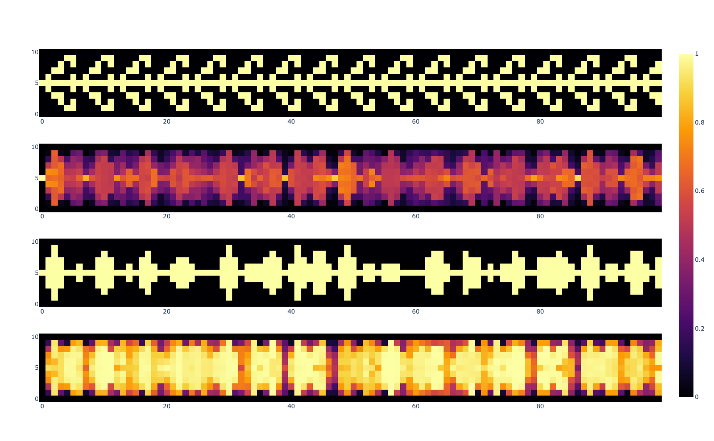

# quantum-cellular-automaton

A classical simulation of the quantum game of life



## Usage
Install dependencies with
```bash
pip install -r requirements.txt
```


List all available parameters with
```bash
python quantum-game.py --help
```


Create and show an example heatmap
```bash
python quantum-game.py --show
```


Use different initial state vectors
```bash
python quantum-game.py --show --initial_states single triple_blinker
```

Use different rules
```bash
python quantum-game.py --show --distance 2 --rule 2 4
```