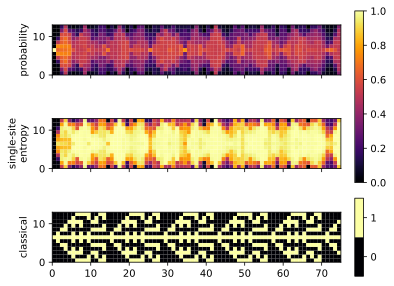

# quantum-cellular-automaton

## A classical simulation of the quantum game of life



## Requirements

Install dependencies with

```bash
pip install -r requirements.txt
```

## Usage

List all available parameters with

```bash
python main.py --help
```

Create and show a plot

```bash
python main.py --show --initial-states single
```

Use different initial state vectors

```bash
python main.py --show --initial-states blinker triple_blinker
```

Use different rules

```bash
python main.py --show --initial-states blinker --distance 2 --activation-interval 2 4
```

Write to different file formats

```bash
python main.py --show --initial-states single --file-formats html svg pdf
```

Try the TDVP algorithm (This can take a while)

```bash
python main.py --show --initial-states single --algorithm tdvp --num-steps 1000
```
